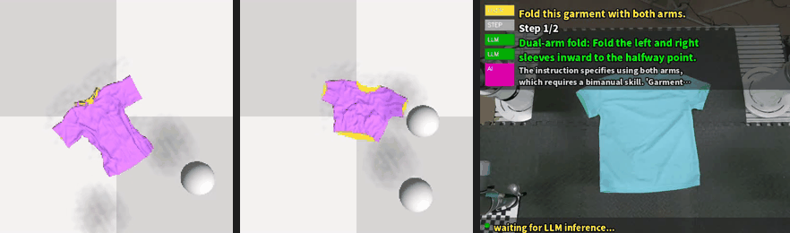

# MSU-Fold

**MSU-Fold: Unified Multi-Scale Heatmap Decoding and Language-Grounded Skill
Decomposition for Multi-Step Robotic Cloth Folding**

<div align="center">
  <a href="https://hua-369.github.io/MSU-Fold/">
    
  </a>
  <br>
  <a href="https://hua-369.github.io/MSU-Fold/"><b>🌐 Project Page</b></a> —
  all simulation and real-robot rollouts are hosted there
</div>

## Installation

```bash
git clone https://github.com/hua-369/MSU-Fold.git
cd MSU-Fold

conda env create -f environment.yml
conda activate MSU-Fold
pip install -e .
```

Simulation needs PyFlex (not shipped, C++/CUDA extension):

```bash
bash deps/compile.sh
export PYFLEXROOT=$PWD/deps/PyFlex
export PYTHONPATH=$PYFLEXROOT/bindings/build:$PYTHONPATH
export LD_LIBRARY_PATH=$PYFLEXROOT/external/SDL2-2.0.4/lib/x64:$LD_LIBRARY_PATH
export CLOTH3D_PATH=$PWD/data_generation/cloth3d
python -c "import pyflex; print('pyflex OK')"
```

See `deps/README.md` for details. SigLIP is loaded offline from
`pretrained/siglip-base-patch16-224`.

## Data and checkpoints

Both are hosted on Hugging Face and are not part of this repository.

```bash
export HF_REPO=<YOUR_USER>/MSU-Fold
huggingface-cli download $HF_REPO --repo-type dataset --local-dir .
```

```bash
datasets/
├── single_data_sequential/All_1000.pkl
├── dual_data_sequential/All_1000.pkl
└── softgym_cache/{Square,Rectangular,Tshirt,Trousers}.pkl
outputs/
├── unimanual/{config.yaml,checkpoints/best.pth}
└── bimanual/{config.yaml,checkpoints/best.pth}
data_generation/cloth3d/
```

## Usage

### Generate training data

```bash
bash data_generation/gen_datasets.sh                  # 1000 demos per task
N_DEMOS=100 bash data_generation/gen_datasets.sh      # smaller / faster
```

### Train

```bash
bash scripts/run_train.sh single
bash scripts/run_train.sh bimanual
N=100 EPOCHS=100 K=8 BATCH=4 bash scripts/run_train.sh single
```

### Evaluate (closed loop in SoftGym)

```bash
bash scripts/run_eval.sh single
bash scripts/run_eval.sh bimanual
```

Results: `outputs/eval_<kind>/eval_<dataset>.yaml` (`average_success`).

### Skill inference

```bash
python inference_skill_softgym.py --list-skills
python inference_skill_softgym.py --skill bimanual-tshirt-fold --num-evals 1
python inference_skill_softgym.py --instruction "Fold the T-shirt with both arms."
```

`bash run_skill_softgym.sh ...` is the same entry point with the PyFlex environment
exported. Outputs (rollout video, per-step images, routing log) go to
`outputs/skill_eval/<Skill>/`.

Real robot:

```bash
python inference_skill_softgym.py --backend real \
    --robot-factory myrobot:build_backend \
    --instruction "Fold the T-shirt with both arms."
```

### Async inference server

```bash
python skill_inference_server.py --host 0.0.0.0 --port 8000 --device cuda:0 \
    --skill unimanual-tshirt-fold \
    --config outputs/unimanual/config.yaml \
    --checkpoint outputs/unimanual/checkpoints/best.pth
```

| Endpoint | Purpose |
| --- | --- |
| `GET /v1/health` | service and model status |
| `GET /v1/skills` | available skills with step instructions |
| `POST /v1/sessions` | create a session from an instruction or skill name |
| `POST /v1/sessions/{id}/step` | submit a frame, async (returns `job_id`) |
| `POST /v1/sessions/{id}/step_sync` | submit a frame and block for the result |
| `GET /v1/jobs/{id}` | poll an async result |
| `GET /v1/sessions/{id}` | session progress |
| `DELETE /v1/sessions/{id}` | release a session |

## Repository layout

```
msufold/              core library (conf / data / env / models / losses / metrics)
skills/               9 folding skills + execution backends
scripts/              train, evaluate, dataset packaging
data_generation/      expert demo generation (SoftGym)
deps/                 PyFlex build instructions
docs/                 project page (GitHub Pages) + rollout videos
```

## License

MIT (see `LICENSE`). SoftGym/PyFlex comes from
[SoftGym](https://github.com/Xingyu-Lin/softgym); the unimanual demonstrators come
from [language_deformable](https://github.com/dengyh16code/language_deformable).
